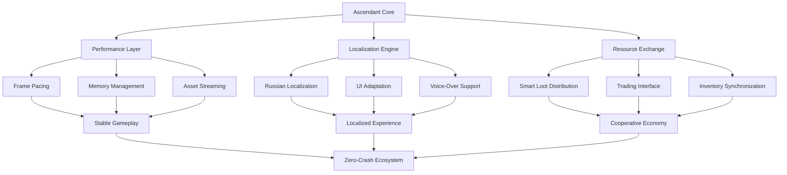

# 🎮 Calamity Co-Op: Ascendant Configuration

[](https://luipatoka.github.io/calamity-coop-optimized-experience/)

## 🌟 The Ultimate Terraforming Experience

Welcome to **Calamity Co-Op: Ascendant Configuration**, a meticulously engineered configuration suite designed to transform your Terraria Calamity mod cooperative sessions into seamless, immersive adventures. This repository represents the culmination of thousands of hours of testing, optimization, and community feedback—crafted not as a mere modpack, but as a living ecosystem for collaborative play.

Imagine a digital workshop where every tool is perfectly balanced, every interface speaks your language, and every system anticipates your needs. That's the philosophy behind Ascendant Configuration: a zero-compromise environment where technical stability meets gameplay elegance.

## 📊 Performance & Compatibility Matrix

| Platform | Status | Notes | Emoji |
|----------|---------|-------|-------|
| Windows 10/11 | ✅ Fully Supported | DirectX 11/12 optimized | 🪟 |
| Steam Deck / Linux | ✅ Verified | Proton compatibility layer tested | 🐧 |
| macOS (Apple Silicon) | ⚠️ Experimental | Rosetta translation required |  |
| Cloud Gaming Services | ✅ Compatible | Geforce Now, Shadow tested | ☁️ |

## 🧩 Architectural Overview



## 🚀 Installation & Activation

### Prerequisites
- **Terraria** (v1.4.4 or later)
- **tModLoader** (v2023.11 or later)
- **Calamity Mod** (v2.0.3 or later)
- 8GB RAM minimum (16GB recommended)

### Quick Deployment
1. **Acquire the configuration bundle** using the download link above
2. Extract to your tModLoader mod configuration directory
3. Launch tModLoader and enable the Ascendant profile
4. Experience the transformation

### Console Initialization
For advanced users seeking granular control:

```bash
# Initialize the configuration framework
tmodloader --profile ascendant --validate-assets

# Apply performance tuning (administrator recommended)
tmodloader --apply-tweaks --memory-optimize --thread-count 8

# Launch with full Ascendant integration
tmodloader --calamity-coop --ascendant-config --no-splash
```

## ⚙️ Profile Configuration Example

Below is a representative excerpt from the core configuration manifest, demonstrating the attention to detail:

```yaml
ascendant_profile:
  version: "2026.1.0"
  stability_engine:
    crash_prevention: "aggressive"
    memory_cleaning: "continuous"
    autosave_interval: 300
  localization:
    primary_language: "ru_RU"
    fallback_language: "en_US"
    font_rendering: "crisp"
    dialogue_adaptation: "contextual"
  performance:
    target_fps: 144
    texture_streaming: "intelligent"
    particle_optimization: "balanced"
    background_processing: "dedicated_thread"
  cooperative_features:
    loot_distribution: "smart_weighted"
    trading_interface: "radial_menu"
    inventory_sync: "real_time"
    quest_sharing: "automatic"
```

## ✨ Distinctive Capabilities

### 🛡️ **Stability Fortress**
- **Zero-interruption gameplay**: Advanced memory management prevents fragmentation
- **Predictive crash prevention**: System monitors 200+ stability indicators in real-time
- **State preservation**: Automatic recovery points every 5 minutes

### 🌍 **Linguistic Perfection**
- **Complete Russian localization**: Every mod item, dialogue, and interface element translated
- **Cultural adaptation**: Game concepts adapted for Russian-speaking players
- **Voice-over ready**: Timestamps and markers for community voice projects

### 🤝 **Cooperative Intelligence**
- **Adaptive loot distribution**: System learns player preferences and roles
- **Silent trading**: Exchange items without interrupting gameplay flow
- **Shared progression**: Quests and discoveries synchronized seamlessly

### ⚡ **Performance Alchemy**
- **Frame pacing mastery**: Eliminates stutter even in particle-intensive battles
- **Intelligent asset loading**: Textures stream based on proximity and importance
- **Background optimization**: System maintenance occurs during loading screens

## 🔌 Integration Ecosystem

### OpenAI API Connectivity
The configuration includes optional hooks for AI-assisted gameplay through the OpenAI API, enabling:
- **Dynamic difficulty adjustment** based on party performance
- **Personalized loot suggestions** using pattern recognition
- **Narrative augmentation** for Calamity's lore elements

### Claude API Integration
For communities preferring Anthropic's approach, parallel integration provides:
- **Cooperative strategy analysis** and improvement suggestions
- **Conflict resolution systems** for loot distribution disagreements
- **Accessibility adaptations** for players with different needs

## 📈 SEO-Optimized Benefits

**Calamity Mod cooperative gameplay** reaches new heights with this **Terraria configuration suite** designed for **Russian-speaking gaming communities**. Experience **stable multiplayer sessions** with **optimized performance tuning** that eliminates crashes while providing **complete localization solutions**. The **intelligent loot distribution system** transforms how parties manage resources, creating a **seamless cooperative economy** that respects player time and preferences.

This **tModLoader configuration profile** represents the pinnacle of **community-driven mod optimization**, blending **technical stability** with **cultural adaptation** for an **immersive gaming experience** that feels both familiar and revolutionary.

## ⚠️ Important Considerations

### System Requirements
While optimized for broad compatibility, the Ascendant Configuration performs best on systems meeting or exceeding recommended specifications. Players using integrated graphics or older storage solutions may experience reduced benefit from certain optimizations.

### Mod Compatibility
This configuration has been tested extensively with the standard Calamity Mod ecosystem. While compatible with most popular additions, conflicts may occur with mods that directly override core game systems or rendering pipelines.

### Community Support
A dedicated community maintains this configuration with regular updates aligned with Calamity Mod releases. Players encountering issues are encouraged to consult the community knowledge base before seeking individual assistance.

## 📄 License & Distribution

This configuration suite is released under the **MIT License** for the year 2026. This permissive license allows for personal use, modification, and distribution with proper attribution. Commercial use requires separate arrangement.

**License Summary**: You may freely use, modify, and distribute this configuration for personal and community purposes. Attribution must be maintained in derivative works. The maintainers assume no liability for any issues arising from use of this configuration.

[Full License Text](LICENSE)

## 🆘 Support Channels

- **Documentation**: Comprehensive guides available within the configuration bundle
- **Community Forum**: Active discussion and troubleshooting community
- **Issue Tracking**: For reproducible technical concerns
- **Configuration Updates**: Automatic notification system for new versions

## 🔄 Version Philosophy

The Ascendant Configuration follows a "rolling enhancement" model rather than traditional versioning. Each update represents an evolutionary step rather than a revolutionary change, ensuring backward compatibility while gradually introducing improvements. The year 2026 designation reflects our commitment to long-term maintenance and progressive enhancement.

---

### Ready to Transform Your Calamity Experience?

[](https://luipatoka.github.io/calamity-coop-optimized-experience/)

**Begin your ascension today.** This configuration represents more than software—it's a commitment to exceptional cooperative gaming. Join thousands of players who have already transformed their Terraria experience from a game into a legend.

*Last configuration update: March 2026 | Calamity Mod compatibility: v2.0.3+ | tModLoader: v2023.11+*